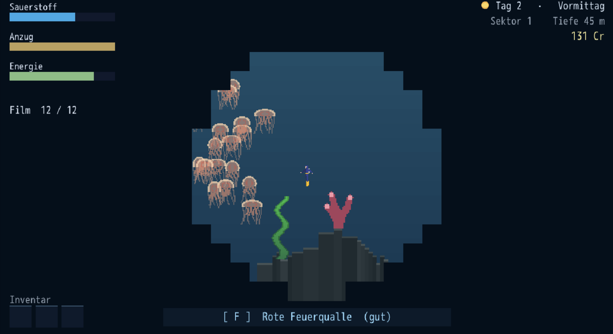

# 🐠 Underwater

You are a freelance underwater wildlife photographer. Dive, find things nobody
has a picture of, and bring the film home.



**▶ [Play it in your browser](https://stammer.dev/underwater/)**  
**⬇ [Download for macOS, Windows or Linux](https://github.com/rstammer/underwater/releases/latest)**

My first game, made with [DragonRuby GTK](https://dragonruby.org). A pet project
for the joy of learning how to make games.

> **The game itself is in German.** This README is not.

## What it is

A 2D pixel-art sea, generated as you swim: sandbanks, kelp forests, reefs and
trenches, walkable islands with tunnel systems inside them, and a blue whale out
in the clear water if you go looking. Twenty-two species live in it, each in its
own biome and depth band — the rarest of them at or below what your suit is
rated for, so the last pages of the book cost real risk.

The camera is the point of all of it:

- **A photograph is a crop, not a snapshot.** Hold the shutter and a frame opens
  wide and closes steadily; letting go is the picture. Getting the animal large,
  whole and centred is the skill, and holding on too long clips it.
- **Several of a kind in one frame is a group shot** — worth more, and released
  earlier, because the group needs a wider frame than one fish does.
- **Fish are shy.** Moving scares them off; keeping still brings them to you. A
  perfect frame is nearer than they will let you swim, so photography here is
  patience rather than chasing.
- **Film is exposed, not banked.** A roll only becomes pages in the Artenbuch
  when it is developed at the boat. Drown out there and the roll goes with you —
  the book does not.

Around that: air and suit pressure as two clocks, energy as a third that makes a
day, sleeping on the boat to end one, finds on the sea floor to sell, and a shop
on an island where the money turns into better gear.

## Controls

| | |
|---|---|
| Arrows / WASD / gamepad | swim — and walk, ashore |
| **Hold `F`** | the shutter. The frame closes while you hold it; **letting go takes the picture** |
| `F` at the boat | develop the roll (darkroom) |
| Space | sprint underwater (costs air, blurs photos) · jump on land |
| `E` | pick up a find · move things between pack and hold in the boat screen |
| `L` | the boat screen: logbook, hold, Artenbuch (`Tab` turns the page) · and the shop, at the shop island |
| `I` | at the boat: stow everything at once |
| `S` | at the boat: sleep, and end the day |
| `Esc` | pause · back out of a screen |
| `Enter` | confirm |
| `Q` | at the boat: quit |

There is a touch layout too — joystick and buttons appear as soon as a finger
touches the screen, so it plays on a phone.

## Downloading it

Every release carries a build for each desktop platform, on the
**[releases page](https://github.com/rstammer/underwater/releases/latest)**:

| | | |
|---|---|---|
| macOS | `underwater-macos.zip` | `Underwater.app` — unzip and open |
| Windows | `underwater-windows-amd64.zip` | one `.exe`, nothing to install |
| Linux | `underwater-linux-amd64.zip` | one `.bin`; `chmod +x` it if the zip did not keep the bit |

These carry their own copy of the engine and need nothing else — the licence
business below is about *building* the game, not playing it.

They are also unsigned, because signing costs a developer account on two
platforms for a game nobody is charging for. So macOS will refuse the first
launch: right-click the app and choose **Open**, which offers you the button
that a double-click does not. Windows shows a SmartScreen panel with the same
way past it under **More info → Run anyway**.

## Where your saves live

A career is one small text file. There are five slots, so five possible files,
next to a one-generation backup of each:

```
book_1.txt   book_1.txt.bak
book_2.txt   book_2.txt.bak
...
```

Copy those away and you have your saves; put them back and you have them again.
The `.bak` beside each one is the state before the last write — if a book ever
comes back wrong, rename that over it.

**The downloaded builds don't keep them next to the game.** DragonRuby writes to
the place each platform keeps application data, so an unzipped game folder you
delete takes nothing with it:

| macOS | `~/Library/Application Support/Underwater/` |
|---|---|
| Windows | `%APPDATA%\Robin Stammer\Underwater\` — i.e. `C:\Users\<you>\AppData\Roaming\Robin Stammer\Underwater` |
| Linux | `~/.local/share/Underwater/` |

**In the browser there is no file.** The web version keeps the same five books in
the browser's IndexedDB, tied to the site they were played on. That means they
survive closing the tab but not clearing site data for stammer.dev, they do not
follow you to another browser or machine, and a private window starts empty every
time. There is no export — if a career matters to you, play a desktop build.

**Running from source** (`./dragonruby .`) is a development build, and those write
straight into the game directory instead: the books turn up in the repo root,
beside `app/`. They are gitignored. This is also why a career built from source
does not appear in the downloaded app — different place, empty shelf. Copying the
`book_*.txt` files into the directory above moves it over, since the game reads
its data directory first and the game directory second.

(A save from before there were slots is a single `artenbuch.txt`. The game adopts
it into slot one on first launch and leaves the original where it is.)

## Running it locally

**The DragonRuby engine is deliberately not in this repo.** It is commercial
software and everything belonging to it is gitignored; only `app/`, `tests/`,
`bin/`, `sprites/` and `sounds/` are versioned. So a fresh clone will not run
until you drop your own licensed copy in:

1. Get DragonRuby GTK (from [itch.io](https://dragonruby.itch.io/dragonruby-gtk)
   or [dragonruby.org](https://dragonruby.org)) and unpack it.
2. Copy the **contents** of `dragonruby-macos/` (the `dragonruby` binary,
   `docs/`, `samples/`, `.dragonruby/`, `font.ttf` …) into this directory —
   **without** the sample `mygame/`. The engine files end up next to `app/` and
   are all ignored by git.

Then:

```sh
./dragonruby .                  # run the game (the game folder is the repo root)
bin/test                        # the whole suite
bin/test tests/framing_tests.rb # one file
```

619 tests across 50 files, run headless in DragonRuby's own test runner.
`bin/test` wraps it because `--test` always exits 0, which is no use to anyone
who wants to know whether the tests passed.

## Assets used

I'm highly thankful for the people that provided the lovely pixel art assets
I used in my game, like

* [SpearFishing by Szym](https://nszym.itch.io/spearfishing-assets-pack)
* [PixelArt Diver by Daniel Kole](https://dkproductions.itch.io/pixel-art-diver)

Everything else — decor, crabs, jellyfish, items, the boat, the diver on land —
is generated from ASCII art and a palette by the scripts in `tools/`.

## Building a web (HTML5 / WASM) version

DragonRuby can export the game to WebAssembly so it runs in the browser — this
works even on the **Standard** license. The output is a folder of plain static
files you can host anywhere.

`dragonruby-publish` expects the game as a *subfolder* next to the engine binary,
so if (like here) your game lives in the engine root, stage it into one first:

```sh
mkdir -p _pkg/underwater
cp -R app sprites sounds metadata _pkg/underwater/
./dragonruby-publish --platforms=html5 --package _pkg/underwater
# -> builds/underwater-html5.zip
```

The same command makes the desktop builds that go on the releases page — the
staged folder is the same one, so it is only the platform list that changes:

```sh
./dragonruby-publish --platforms=macos,linux-amd64,windows-amd64 --package _pkg/underwater
# -> builds/underwater-{macos,linux-amd64,windows-amd64}.zip
```

`builds/` is gitignored: the zips are already compressed, so git can neither
pack them down nor tell two versions apart, and each release would put its full
weight into the history for good. They live on the releases page instead, where
they can also be deleted again.

This needs a `metadata/game_metadata.txt` (the publisher tells you the exact
fields if it's missing). Unzip it and test locally with the bundled server:

```sh
mkdir _webtest && cd _webtest && unzip ../builds/underwater-html5.zip
cd .. && ./dragonruby-httpd _webtest    # open http://localhost:8080/
```

**Hosting it elsewhere — the one gotcha:** the WASM runtime uses
`SharedArrayBuffer`, which browsers only grant to a *cross-origin isolated*
page. Serve `index.html` with **both** of these headers or the game won't boot:

```
Cross-Origin-Opener-Policy: same-origin
Cross-Origin-Embedder-Policy: require-corp
```

`dragonruby-httpd` sets them for you; on your own server you have to add them.
(The export also ships a service worker that can inject them client-side as a
fallback, but setting them on the server is more reliable.)

The live instance runs at <https://stammer.dev/underwater/>.
